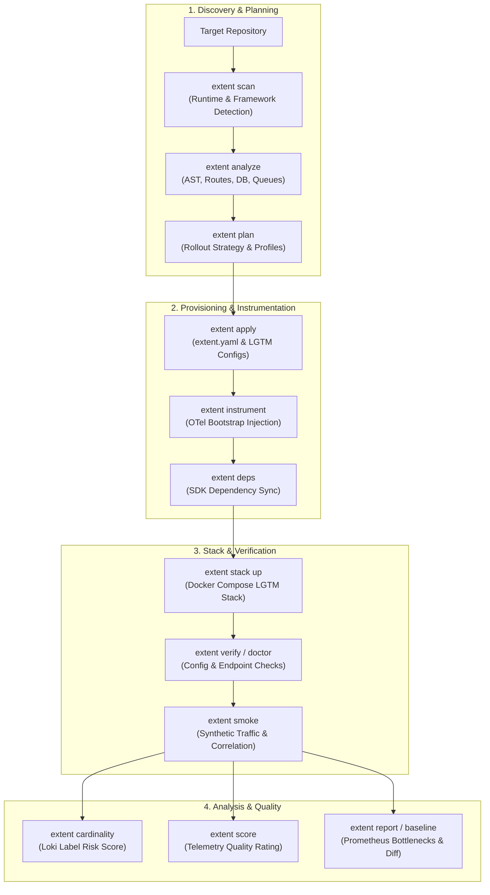
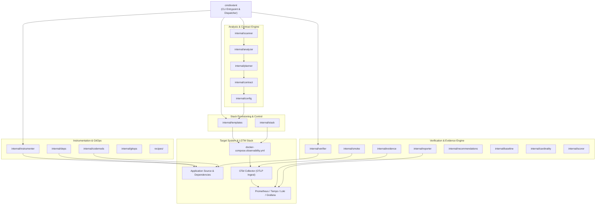

# Architecture

Extent is a single Go binary. It reads a target repo, writes reviewable files,
and talks to a local Docker Compose stack. Every mutation is planned first and
recorded so it can be previewed and undone.

## Workflow

Commands run in this order for a typical project:

```text
scan -> analyze -> plan -> apply -> instrument -> stack up -> verify -> smoke -> report -> score
```



## Design goals

Adding observability to a project usually means stitching together SDK setup,
environment variables, Docker networking, collectors, dashboards, and
verification by hand. Extent turns that into a guided workflow. It compares as
follows:

| Feature | Extent | Manual |
| :--- | :--- | :--- |
| **Structural integrity** | Generates a bounded OpenTelemetry bootstrap and local LGTM configuration with pinned dependencies for supported targets. | Manual version selection and configuration. |
| **Cross-domain sync** | Transactional changes with ownership checks, exact backups, idempotent apply, and conflict-safe undo. | Manual coordination of SDKs and configuration files. |
| **Source changes** | Syntax-aware Go import and lifecycle edits. Node and Python bootstrap edits are deliberately constrained. Deep codemods are experimental. | Manual source editing. |
| **Operational safety** | Built-in cardinality checks and telemetry quality scoring (`extent score`). | Risk of cardinality explosion or broken trace context. |
| **Feedback loop** | Service-scoped smoke checks correlate synthetic traffic with Prometheus metrics, Tempo traces, and Loki logs. | Custom traffic generation and manual validation. |

Extent treats the OpenTelemetry APIs, SDKs, semantic attributes, resources,
instrumentation scopes, and the Collector pipeline as the observability
contract. Generated files are meant to be reviewed, diffed, and undone rather
than hidden behind one-shot scripts.

## Packages

```text
cmd/extent                CLI entrypoint and command handlers (cmd_*.go)
recipes/                  Framework recipe metadata (detect, inject, support level)
internal/buildinfo        Version and build metadata
internal/scanner          Repo detection: runtimes, frameworks, package managers, entrypoints
internal/analyzer         Deep repository analysis and recommendations inputs
internal/config           extent.yaml parsing and validation
internal/contract         extent.yaml observability contract rendering
internal/planner          Proposed changes and next steps
internal/templates        Generated LGTM and OpenTelemetry files (Compose, Collector, Prometheus, Loki, Tempo, Grafana)
internal/stack            Docker Compose wrapper: preflight, up, down, status, readiness
internal/instrumenter     Node, Python, Go, and .NET bootstrap source injection
internal/codemods         Generated experimental deep AST/codemod patcher bundle
internal/deps             Dependency install command planning and execution
internal/gitops           Branch creation and git helpers
internal/fileops          Transactional writes, backups, and undo for generated files
internal/state            .extent/state.json ownership manifest
internal/process          Bounded subprocess runner used by stack and deps
internal/observability    Bounded HTTP client and URL validation for query APIs
internal/evidence         Tempo, Loki, and Prometheus evidence query clients
internal/smoke            App traffic and telemetry correlation checks
internal/verifier         Generated-file and endpoint verification (verify, doctor)
internal/reporter         Prometheus-backed bottleneck report synthesis
internal/recommendations  Evidence-backed remediation synthesis
internal/baseline         Before/after snapshot persistence and comparison
internal/cardinality      Loki label cardinality safety analysis
internal/scorer           Telemetry quality scoring
testdata/e2e/             Tiny fixture apps used by the live LGTM acceptance workflow
```

## Component diagram



## Exit codes and JSON

The exit-code table and the JSON `schema` contract are in [cli.md](cli.md).
Schemas live in [`schemas/`](../schemas/).
