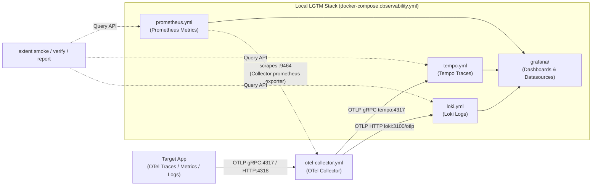

# Generated files and the local LGTM stack

`extent apply` writes the observability files below into the target repo.
Review them with `git diff` before committing. Extent refuses to overwrite an
existing file whose content would change, unless you pass `--force`. `--force`
does not overwrite a file you edited by hand: revert your edit first (see
[troubleshooting](troubleshooting.md#re-running-apply-needs---force)).

## Files written by `extent apply`

```text
extent.yaml                         observability contract (edit it, then re-run apply)
.env.observability                  app telemetry settings and the Grafana admin login
docker-compose.observability.yml    the LGTM stack definition
otel-collector.yml                  OpenTelemetry Collector pipelines
tempo.yml                           Tempo (traces)
loki.yml                            Loki (logs)
prometheus.yml                      Prometheus (metrics) scrape config
prometheus-alerts.yml               Prometheus alert rules
grafana/
  provisioning/
    datasources/datasources.yml     Tempo, Loki, Prometheus datasources
    dashboards/dashboards.yml       dashboard provider
  dashboards/service-overview.json  starter dashboard
.extent/
  plan.json                         the plan that produced these files
  report.md                         human-readable summary
  state.json                        ownership and hashes of Extent-written files
```

`.extent/state.json` is how Extent knows a file is its own. Do not edit it by
hand. `.extent/` also holds `backups/` (instrument backups) and `baseline.json`
(from `extent baseline`).

## `.env.observability`

The file has two parts:

- **App telemetry settings.** `OTEL_SERVICE_NAME` is a placeholder
  (`your-service-name`) that you must set. `OTEL_EXPORTER_OTLP_ENDPOINT` is
  `http://otel-collector:4318` for apps on the Compose network. For apps running
  on the host, use `http://localhost:4318` instead. The file keeps this form as a comment.
- **Grafana admin login.** `GRAFANA_ADMIN_USER=admin` and a generated
  `GRAFANA_ADMIN_PASSWORD` (24 random alphanumeric characters). Re-running
  `apply` keeps the existing password.

Grafana login: user `admin`, password from `GRAFANA_ADMIN_PASSWORD` in
`.env.observability`. The password is set when the Grafana volume is first
created. See [troubleshooting](troubleshooting.md#grafana-password-changed-but-login-fails)
if you change it later.

## Profiles

The profile is set by `extent apply --profile` or the `profile.name` field in
`extent.yaml`. Accepted values are `minimal`, `full` (default), `high-cardinality-safe`,
`low-resource`, and `report-heavy`. The profile changes the generated
Collector only:

| Profile | Collector change |
| --- | --- |
| `full` | Tail sampling, memory limit 512 MiB (spike 128 MiB), up to 50,000 traces in memory, slow threshold 500 ms. |
| `minimal` | No tail sampling. Memory limit 256 MiB (spike 64 MiB). |
| `low-resource` | As `full`, but 256 MiB (spike 64 MiB), 2,000 traces in memory, 25 new traces per second. |
| `high-cardinality-safe` | As `full`, plus redaction of `db.statement` and `enduser.id`. |
| `report-heavy` | As `full`, but slow threshold 250 ms. |

Tail sampling (in `full` and the other non-minimal profiles) keeps a trace if it
has any of these:

1. The `x_request_id` header (`http.request.header.x_request_id`), so `smoke` can find it.
2. An `ERROR` status.
3. Latency at or above the slow threshold.

It keeps 10% of all other traces. The decision wait is 5 seconds.

The Collector always deletes the `authorization` and `cookie` request headers
from traces. `high-cardinality-safe` also deletes `db.statement` and `enduser.id`.

## The LGTM stack

The stack is defined in `docker-compose.observability.yml`. All published ports
bind to `127.0.0.1` only.

| Service | Host port | Role |
| --- | --- | --- |
| `otel-collector` | 4317 (gRPC), 4318 (HTTP) | OTLP ingest for apps |
| `tempo` | 3200 | Traces |
| `loki` | 3100 | Logs (OTLP over HTTP at `/otlp`) |
| `prometheus` | 9090 | Metrics |
| `grafana` | 3000 | Dashboards and datasources |

Grafana and Prometheus have Compose healthchecks. Loki and Tempo have none, and
`extent stack up --wait` polls their `/ready` endpoints instead.

Persistent named volumes (`grafana-data`, `tempo-data`, `loki-data`,
`prometheus-data`) are used by the stack. `extent stack down` keeps them.

**Host metrics.** The Compose template can add `cadvisor` and `node-exporter`
for Linux hosts, through a `host-metrics-linux` stack profile. That profile is
not reachable from this build: `apply --profile` and `extent.yaml` both reject
it. The default generated stack therefore has no container or host exporters.
Treat host metrics as unavailable in this release.

## Diagrams

Metrics, traces, and logs flow from the app through the Collector into the
backends. Prometheus scrapes the Collector's Prometheus exporter on port 9464.
There is no remote write.



For how the CLI commands and packages fit together, see
[architecture.md](architecture.md).
